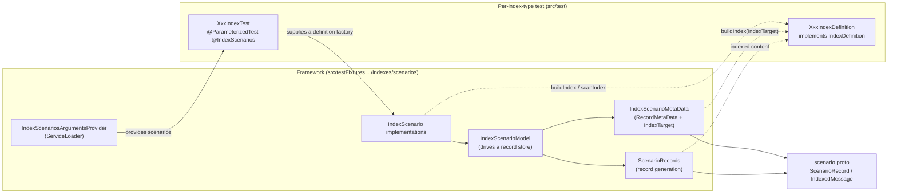
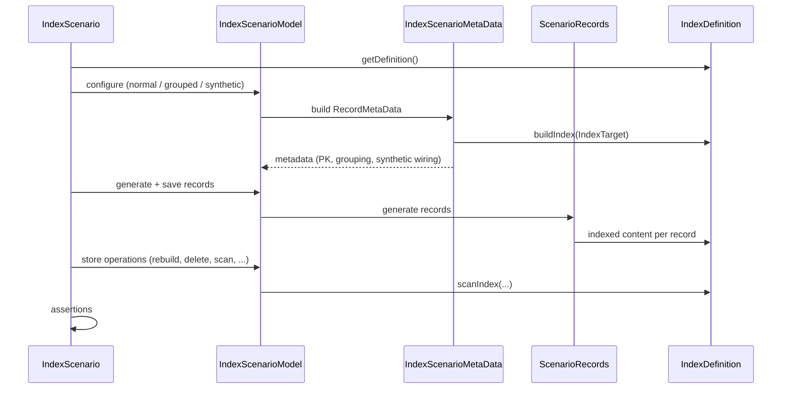
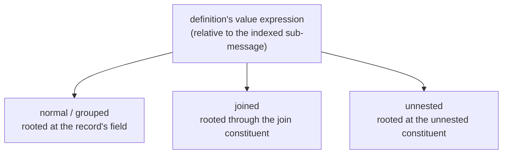

# Index Maintainer Scenario Testing Framework

A small, extensible harness for exercising **index maintainers** against a shared battery of
**scenarios** (rebuild, write-only maintenance, snapshot isolation, group deletion, synthetic
record types, …). Each index type is described **once** by a tiny `IndexDefinition`; the framework
owns everything else — record metadata, record generation, primary keys, grouping, and
synthetic-type wiring — and runs every scenario against every index type automatically.

> **Why:** maintainer behaviour is easy to get subtly wrong and hard to cover uniformly. This turns
> "does index type *X* behave correctly under scenario *Y*?" into a matrix that fills in by itself:
> a new index type is tested by all existing scenarios, and a new scenario runs against all existing
> index types — with no cross-wiring.

---

## Architecture



Two responsibilities are cleanly split:

- **The definition** says *what* to index and *how* to scan it — nothing about storage, records, or
  scenarios.
- **The framework** owns *how* records are shaped and stored and *which* scenarios run, so those
  concerns evolve independently of the index types.

Scenarios are discovered as `ServiceLoader` plugins, so a test class never names them; it only wires
in its definition:

```java
@ParameterizedTest
@IndexScenarios // scenarios injected by the framework
void indexScenariosTest(IndexScenario scenario) throws Exception {
    scenario.runTest(
            // the index type under test
            XxxIndexDefinition::new,
            // how to open a transaction
            () -> database.openContext(config),
            // an appropriate store builder, notably does not set the metadata
            FDBRecordStore.newBuilder().setKeySpacePath(path));
}
```

> **Note:** The arguments for how to open a store or context are mostly so that this can fit well
> into existing test classes which have different ways of specifying the context/path.

---

## How a scenario run flows



---

## The shared schema + `IndexTarget`

Rather than a bespoke record type per index, the framework uses **one** record type whose indexable
content is a **generic sub-message**. A definition fills in only the field(s) it cares about; the
framework owns the primary key and the grouping field.

The definition writes its value expression **relative to that sub-message**, and an `IndexTarget`
roots it at wherever the sub-message actually lives for the current run. That single indirection is
what lets one `buildIndex` implementation serve normal, grouped, and synthetic (joined/unnested)
runs — so synthetic-type coverage comes essentially for free for every index type.



Where a maintainer genuinely cannot support a scenario, its definition opts out via a capability
flag (with the reason documented at the opt-out) — so the matrix stays green without weakening the
scenario for everyone else.

---

## Extending it

- **New index type** — add an `IndexDefinition` (what to index, how to scan) and a thin test that
  wires it into `@IndexScenarios`. All scenarios then run against it automatically.
- **New scenario** — add an `IndexScenario` (`@AutoService`). It immediately applies to every index
  type.

Neither requires touching the shared proto, the other definitions, or the framework core.

---

## Component reference

| Type | Role |
|---|---|
| `IndexScenario` / `@IndexScenarios` / `IndexScenariosArgumentsProvider` | A scenario and its ServiceLoader-based discovery/injection as JUnit arguments. |
| `IndexDefinition` / `IndexDefinitionFactory` | Per-index-type description and its supplier. |
| `IndexTarget` | Roots a definition's value expression at the indexed sub-message; supplies the grouping prefix. |
| `IndexScenarioMetaData` | Builds `RecordMetaData` (primary-key alignment, grouping, joined/unnested wiring). |
| `ScenarioRecords` | Generates records over the shared schema; holds the field/type-name constants. |
| `IndexScenarioModel` | Wraps a definition + context + store builder; store/index operations and result assertions. |
| scenario proto | The shared schema: one record type with a generic indexable sub-message. |

## Current limitations

So far a few limitations have been found:

### `COUNT_UPDATES`

Some of the existing tests are based on the idea that rebuilding the index should result in the same resulting data. This is not true for `COUNT_UPDATES`, and notably `InsertWhileWriteOnlyAlreadyIndexed` has special handling for `COUNT_UPDATES`, which is not great. In theory there is some abstraction akin to `This index type tracks updates`, which could also be applicable if we added a change-tracking index.

### TimeWindowLeaderboard

This currently has all of the special behavior/overrides. Some more investigation is probably worthwhile to check whether it could be handled better.

### `MAX_EVER`/`MIN_EVER`

There is not an example of this yet, but if we add more examples that delete data (which seem good to have), an additional flag about whether deletes matter would be needed.

### `scanResultsEqual`

This method was added during development to make things work, but is no longer overridden. It’s possible this will be needed in the future.

## Future work

### Immediate

- [] **Lucene** - with partitioning
- [] **Lucene** - without partitioning
- [] **Sliding Window**
- [] **Index validation** - particularly for Lucene/Sliding Window, validating their internal details are consistent (i.e. counts). There is a `validateEntries` method on `IndexMaintainer`, but it looks like that is only implemented by `ValueIndexMaintainer`, so it would probably be good to replace that with scrubbing, and a new method on the `IndexDefinition`. This new `IndexDefinition` method would be somewhat different from scrubbing, because it can run across multiple transactions, assuming the data is not changing.
- [] **Basic Delete** - a basic delete test
